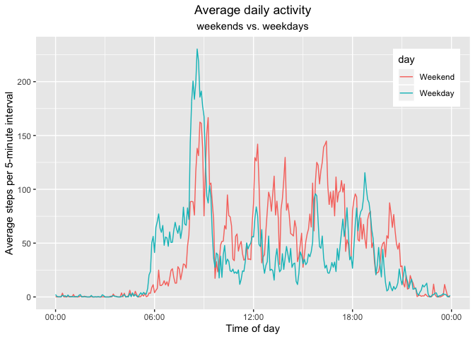

## Loading and preprocessing the data

Unzip and read the data in and store in the variable "data", then take a look at the str.

```r
unzip("activity.zip")
data <- read.csv("activity.csv")
head(data, 15)
```

```
##    steps       date interval
## 1     NA 2012-10-01        0
## 2     NA 2012-10-01        5
## 3     NA 2012-10-01       10
## 4     NA 2012-10-01       15
## 5     NA 2012-10-01       20
## 6     NA 2012-10-01       25
## 7     NA 2012-10-01       30
## 8     NA 2012-10-01       35
## 9     NA 2012-10-01       40
## 10    NA 2012-10-01       45
## 11    NA 2012-10-01       50
## 12    NA 2012-10-01       55
## 13    NA 2012-10-01      100
## 14    NA 2012-10-01      105
## 15    NA 2012-10-01      110
```

We notice that the interval counter is recorded in hh:mm format, but is currently saved as an integer so we should convert that to a proper POSIX format using lubridate.


```r
library(lubridate)
```

```
## 
## Attaching package: 'lubridate'
```

```
## The following object is masked from 'package:base':
## 
##     date
```

```r
data$datetime <- parse_date_time(paste(data$date, sprintf("%04d", data$interval), sep = " "), "Ymd_HM")
```

***

## Q1 : What is mean total number of steps taken per day?
Ignoring the NA values, create a histogram for the total number of steps taken each day.

```r
library(dplyr)
```

```
## 
## Attaching package: 'dplyr'
```

```
## The following objects are masked from 'package:lubridate':
## 
##     intersect, setdiff, union
```

```
## The following objects are masked from 'package:stats':
## 
##     filter, lag
```

```
## The following objects are masked from 'package:base':
## 
##     intersect, setdiff, setequal, union
```

```r
library(ggplot2)

stepsXday <- aggregate(data$steps, list(data$date), FUN = "sum", na.rm = TRUE)
names(stepsXday) <- c("day","steps")
stepsXday$day <- as.Date(stepsXday$day, format = "%Y-%m-%d")

p1 <- ggplot(data=stepsXday, aes(x=steps)) + 
  geom_histogram(binwidth = 2000, fill = "steelblue") +
  labs(title = "Histogram of steps per day, missing values ignored"
       , x = "total steps per day"
       , y="frequency")
p1
```

<!-- -->

Find the mean and median daily steps:

```r
medianSteps <- median(stepsXday$steps)
meanSteps <- mean(stepsXday$steps)
meanSteps
```

```
## [1] 9354.23
```

```r
medianSteps
```

```
## [1] 10395
```
So we calculate using basic R functions that in the dataset the mean steps per day is 9354.2295082 and the median steps per day is 10395.

*** 

## Q2 : What is the average daily activity pattern?

First we calculate the average for each interval (excluding missing values), across all days, and put it into a new data frame. 

```r
stepsXint <- aggregate(data$steps, list(data$interval), FUN = "mean", na.rm = TRUE)
names(stepsXint) <- c("interval", "avg.steps")
stepsXint$time <- as.POSIXct(sprintf("%04d", stepsXint$interval), format = "%H%M", tz = "UTC")
```

Now using these calculated averages, we will make a time series plot of the 5-minute interval (x-axis) and the average number of steps taken, averaged across all days (y-axis)

```r
p2 <- ggplot(stepsXint, aes(x = time, y = avg.steps)) +
  geom_line(color = "#00AFBB", size = 1) + 
  labs(x= "Time of day", y = "Average steps") +
  scale_x_datetime(date_labels = "%H:%M")
p2
```

<!-- -->

Now we can find the maximum average steps and its corresponding interval:

```r
maxAvgSteps <- floor(max(stepsXint$avg.steps))

maxStepInt <- strftime(stepsXint[which.max(stepsXint$avg.steps),"time"]
                       , tz = "UTC"
                       , format = "%H:%M")
```

### Q2 Answer: 
We can see that the average maximum number of steps, 206, occurrs during the interval at 08:35.

***

## Q3 : Imputing missing values

1. Calculate and report the total number of missing values in the dataset (i.e. the total number of rows with `NA`s)

```r
NArows <- NROW(data) - sum(complete.cases(data))
```
There are 2304 rows that have one or more missing values. 

2. Devise a strategy for filling in all of the missing values in the dataset. The strategy does not need to be sophisticated. For example, you could use the mean/median for that day, or the mean for that 5-minute interval, etc.

We will replace the NA values of missing step counts with the median for that interval: 
  
  i) First we'll need a logical vector to identify which values are missing. 
  ii) Next create a table with just the median from each interval, naming the variables after the interval. 
  iii) Finally, replace the NAs with the median step count for that interval. 

3. Create a new dataset that is equal to the original dataset but with the missing data filled in.

```r
imputed_data <- data
nas <- is.na(imputed_data$steps)
avg_interval <- tapply(imputed_data$steps, imputed_data$interval, mean, na.rm=TRUE)
imputed_data$steps[nas] <- avg_interval[as.character(imputed_data$interval[nas])]
```

Let's just check to make sure the NA values have been replaced (there were a few right at the head of the data) and there are no more missing values in the data:


```r
head(imputed_data)
```

```
##       steps       date interval            datetime
## 1 1.7169811 2012-10-01        0 2012-10-01 00:00:00
## 2 0.3396226 2012-10-01        5 2012-10-01 00:05:00
## 3 0.1320755 2012-10-01       10 2012-10-01 00:10:00
## 4 0.1509434 2012-10-01       15 2012-10-01 00:15:00
## 5 0.0754717 2012-10-01       20 2012-10-01 00:20:00
## 6 2.0943396 2012-10-01       25 2012-10-01 00:25:00
```

```r
sum(is.na(imputed_data$steps))
```

```
## [1] 0
```

```r
NROW(imputed_data) - sum(complete.cases(imputed_data))
```

```
## [1] 0
```

4. Make a histogram of the total number of steps taken each day and Calculate and report the **mean** and **median** total number of steps taken per day. Do these values differ from the estimates from the first part of the assignment? What is the impact of imputing missing data on the estimates of the total daily number of steps?


```r
stepsXday_impt <- aggregate(imputed_data$steps, by=list(imputed_data$date), FUN = sum)
names(stepsXday_impt) <- c("date", "total.steps")

p3 <- ggplot(data=stepsXday_impt, aes(x=total.steps)) + 
  geom_histogram(binwidth = 2000, fill="forestgreen") +
  labs(title = "Histogram of steps per day, missing values imputed"
       , x = "total steps per day"
       , y="frequency")
p3  
```

<!-- -->

```r
meanSteps_impt <- mean(stepsXday_impt$total.steps)
medianSteps_impt <- median(stepsXday_impt$total.steps)
meandiff <- abs(meanSteps - meanSteps_impt)
mediandiff <- abs(medianSteps - medianSteps_impt)
```

### Q3 Answer:
After imputing the missing values, we calculate the mean steps per day to be 1.0766189\times 10^{4} and median steps per day to also be 1.0766189\times 10^{4}.

When comparing the difference between ignoring and imputing the missing values, the average differs by 1411.959171, and the median differs by 371.1886792.


***

## Q4 : Are there differences in activity patterns between weekdays and weekends?

We will use the version of the data with imputed values for this question. 
First, Create a boolean variable called 'wknd' (weekend = TRUE, weekday = FALSE), 
split into two data frames using wknd as the factor

```r
imputed_data$wknd <- (wday(imputed_data$datetime) %in% c(1,7))
data_byWknd <- split(imputed_data, imputed_data$wknd)
dflabels <- c("steps", "date", "interval", "datetime", "wknd")
data_wkday <- as.data.frame(data_byWknd[1])
names(data_wkday) <- dflabels
data_wknd <- as.data.frame(data_byWknd[2])
names(data_wknd) <- dflabels
```

Now we will compute weekday interval averages and weekend interval averages in the same way as we did for Q2:

```r
wkday_stepsXint <- aggregate(data_wkday$steps, list(data_wkday$interval), FUN = "mean", na.rm = TRUE)
names(wkday_stepsXint) <- c("interval", "avg.steps")
wkday_stepsXint$time <- as.POSIXct(sprintf("%04d", wkday_stepsXint$interval), format = "%H%M", tz = "UTC")
wkday_stepsXint$day <- as.factor(c("Weekday"))

wknd_stepsXint <- aggregate(data_wknd$steps, list(data_wknd$interval), FUN = "mean", na.rm = TRUE)
names(wknd_stepsXint) <- c("interval", "avg.steps")
wknd_stepsXint$time <- as.POSIXct(sprintf("%04d", wknd_stepsXint$interval), format = "%H%M", tz = "UTC")
wknd_stepsXint$day <- as.factor(c("Weekend"))

wdata <- rbind(wknd_stepsXint, wkday_stepsXint)
```

Finally we'll plot these two data sets in two panels


```r
qplot(time, avg.steps, data=wdata, geom="line", facets="day")
```

<!-- -->

The pattern is kind of hard to see- let's plot the lines on the same graph see it more clearly:

```r
p5 <- ggplot(wdata, aes(x = time, y = avg.steps, color = day)) +
  geom_line(size = 0.5) + 
  ggtitle("Average daily activity", subtitle = "weekends vs. weekdays") +
  labs(x= "Time of day", y = "Average steps per 5-minute interval") +
  scale_x_datetime(date_labels = "%H:%M") +
  theme(legend.position = c(.9, .85)
        , plot.title = element_text(hjust = .5)
        , plot.subtitle = element_text(hjust = .5) )
p5
```

<!-- -->

### Q4 Answer:
It looks like the data show a later start to activity, but greater activity spread throughout the day on weekends, as compared to weekdays. 
